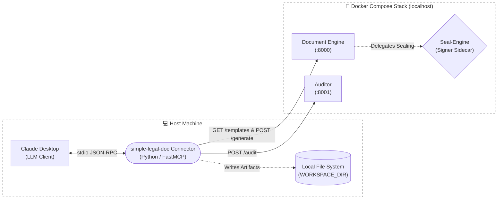

# Claude Desktop MCP Connector  
  
This directory contains the host‑executed MCP bridge that connects Claude Desktop to the `simple-legal-doc` backend stack. The connector runs directly on the operator's machine, is not containerized, and is independent of the Dockerized backend services in this repository.  
  
---  
  
## Scope Note  
  
This directory contains the only MCP connector currently implemented in the `simple-legal-doc` repository. It is specifically designed for Claude Desktop and its stdio‑based MCP runtime.  
  
If additional connectors for other runtimes (for example IDE agents, CI automation, or alternative desktop hosts) are introduced in the future, this directory may be renamed or reorganized at that time.  
  
---  
  
## Architecture Overview  
  

  
### How this diagram reflects the system constraints  
  
- **Host execution:** The connector runs entirely on the host machine and is not containerized.  
- **stdio communication:** Claude Desktop communicates with the connector exclusively over stdio JSON‑RPC, which is why stdout purity is mandatory.  
- **Network isolation:** The connector communicates with backend services only via HTTP on `localhost`.  
- **Local file I/O:** All generated artifacts are written to a bounded local workspace directory.  
- **Separation of concerns:** The Document Engine delegates cryptographic sealing to a dedicated signer sidecar and never holds private key material.  
  
---  
  
## Directory Structure  
  
```text  
connector/  
├── mcp_server.py        # FastMCP application exposing the connector tool surface  
├── config.py            # Environment loading and workspace validation  
├── payments.py          # x402 stateless challenge/response middleware  
├── requirements.txt     # Runtime dependencies (mcp, httpx)  
└── setup/  
    ├── setup_mcp_connector.bat   # Windows MSIX junction and config script  
    ├── setup_mcp_connector.sh    # macOS / Linux config script  
    └── validate_backend.sh       # Eight-test backend health suite  
```  
  
---  
  
## Enterprise Execution Guide  
  
### Prerequisites  
  
Ensure the following are available on the host machine before beginning:  
  
- Python 3.11 or later (**absolute path required** for Claude Desktop configuration)  
- Docker and Docker Compose (for the backend stack)  
- Claude Desktop installed  
  
---  
  
### Step 1 — Start the Backend Stack  
  
```bash  
docker compose build  
docker compose up  
```  
  
Verify both service endpoints are live before proceeding:  
  
```bash  
curl http://localhost:8000/templates   # Document Engine  
curl http://localhost:8001/health      # Auditor  
```  
  
Both must return HTTP 200. If either fails, diagnose the container before continuing.  
  
---  
  
### Step 2 — Run the HTTP Validation Suite  
  
Execute all eight integration tests against the backend. The suite verifies endpoint availability, template registry content, schema generation, draft‑mode rendering, payload validation, and Auditor reachability.  
  
```bash  
chmod +x connector/setup/validate_backend.sh  
./connector/setup/validate_backend.sh  
```  
  
> **🛑 STOP:** All eight tests must pass. If any fail, stop and restore backend health before proceeding. Do not configure the MCP connector against a partially healthy backend.  
  
---  
  
### Step 3 — Install Connector Dependencies  
  
Create a dedicated virtual environment for the connector and install its dependencies.  
  
```bash  
cd connector  
python3 -m venv venv  
source venv/bin/activate          # macOS / Linux  
# venv\Scripts\Activate.ps1       # Windows  
  
pip install -r requirements.txt  
```  
  
Note the absolute path to the virtual environment's Python executable. This exact path must be used in the Claude Desktop configuration file.  
  
```bash  
which python            # macOS / Linux  
# where.exe python      # Windows
# e.g. /Users/username/simple-legal-doc/connector/venv/bin/python3  
```  
  
Do not use the system Python or any activation shim.  
  
---  
  
### Step 4 — Configure the MCP Connector  
  
*(Note: Steps 1–3 **must** be complete and the backend validation suite must have passed before running this step.)*  
  
Run the platform‑specific setup script. The script will **interactively prompt** for:  
  
- the **absolute path to `mcp_server.py`**  
- the **absolute path to the Python executable** used for the connector  
  
These values are written verbatim into `claude_desktop_config.json`. Relative paths, environment variables, and activation shims are not supported.  
  
#### macOS / Linux  
  
```bash  
chmod +x setup/setup_mcp_connector.sh  
./setup/setup_mcp_connector.sh  
```  
  
The script writes to:  
  
- macOS: `~/Library/Application Support/Claude/claude_desktop_config.json`  
- Linux: `~/.config/Claude/claude_desktop_config.json`  
  
#### Windows  
  
```text  
setup\setup_mcp_connector.bat  
```  
  
*(Run as Administrator if group policy blocks directory junction creation.)*  
  
The script creates a directory junction so that the MSIX‑virtualized configuration path and the canonical `%APPDATA%\Claude` path resolve to the same files. If the junction cannot be created due to group policy restrictions, an administrator may create it manually:  
  
```cmd  
mklink /D "%LOCALAPPDATA%\Packages\<ClaudePackageDir>\LocalCache\Roaming\Claude" "%APPDATA%\Roaming\Claude"  
```  
  
Replace `<ClaudePackageDir>` with the actual package directory, identified by listing `%LOCALAPPDATA%\Packages\` and locating the entry beginning with `AnthropicPBC.ClaudeDesktop_` or `Claude_`. After the junction is established, always edit `%APPDATA%\Roaming\Claude\claude_desktop_config.json` directly. Do not use the Claude Desktop "Edit Config" button.  
  
---  
  
#### Workspace directory  
  
By default, the connector writes all generated PDF artifacts to:  
  
- **macOS / Linux:** `~/Downloads`  
- **Windows:** `%USERPROFILE%\Downloads`  
  
This directory is validated at connector startup. If it does not exist or is not writable, the connector will fail fast and refuse to start.  
  
Override by setting `WORKSPACE_DIR` in the MCP server configuration environment block.  
  
---  
  
#### x402 Payment Rail  
  
Both setup scripts default `X402_ENABLED` to `false`.  
  
Set it to `true` **only after** replacing the signing stub in `payments.py` with a production wallet or KMS‑backed signer. The `deadbeef` stub produces deterministically invalid signatures and must never be enabled in a live environment.  
  
---  
  
### Step 5 — Launch Claude Desktop  
  
Start Claude Desktop and wait for the MCP handshake to complete. The hammer icon indicates that the connector is registered and the tool manifest has been received.  
  
Issue the initial validation prompt:  
  
> **List available templates.**  
  
Claude should invoke `list_templates` and return the registered template slugs without error. If no tool call occurs or an error is returned, inspect the connector's stderr output in the terminal that launched Python.  
  
All operational logging is emitted to stderr. Stdout is reserved exclusively for JSON‑RPC framing.  
  
---  
  
## End‑to‑End Test Sequence  
  
To fully exercise the pipeline:  
  
1. **Draft generation**  
   "List available templates, then generate a draft compliance‑test‑doc with HIGH risk level, a detailed justification, and a deliberately weak mitigation strategy."  
  
2. **Final artifact generation**  
   "Now generate the final sealed version."  
  
---  
  
## Enterprise Validation Checklist  
  
Before declaring the deployment production‑ready, verify the following invariants:  
  
- [ ] Startup time under 1.0 second  
- [ ] Stdout purity preserved (no non‑JSON‑RPC output)  
- [ ] No dropped tool calls during heavy draft rendering on Windows  
- [ ] `generate_draft` completes in under 5 seconds  
- [ ] `generate_final` completes in under 15 seconds  
- [ ] Correct x402 failure behavior when enabled  
- [ ] Tool definition hash is stable across restarts  
- [ ] Path containment enforced for `audit_document`  
  
---  
  
## Architecture & Development Constraints  
  
The following constraints are mandatory for all changes to the connector:  
  
- [ ] The connector remains host‑executed; no Dockerfile exists in `connector/`  
- [ ] Stdout purity is preserved; no `print()` calls exist in connector code  
- [ ] All operational logging is emitted to stderr  
- [ ] The connector performs **no network I/O during module import**; all HTTP requests occur strictly inside tool handlers  
- [ ] Line endings are correct: `.sh` uses LF, `.bat` uses CRLF  
- [ ] `X402_ENABLED` defaults to `false` in all setup scripts  
- [ ] The tool definition hash block remains present and intact  
- [ ] The connector must not pull in backend dependencies (LaTeX, cryptography, etc.)  
- [ ] The Windows setup script creates a directory junction so both config paths resolve to the same files  
- [ ] The connector is never invoked via shell wrappers or activation shims  
  
---  
